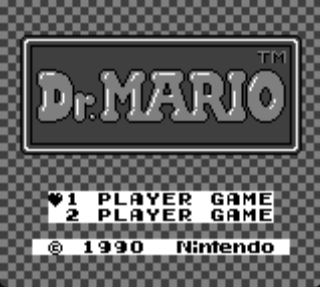
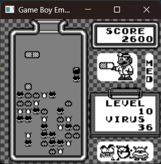
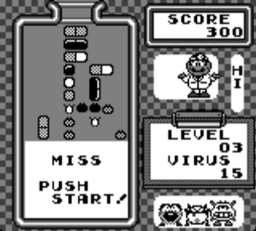
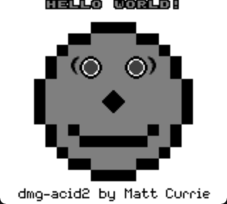
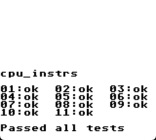

# GameBoy Emulator

This is a GameBoy emulator written in C++17 with SDL3 support for window rendering and input handling. It can only runs ROM-only cartridges but support for other cartridge types are on the timeline. There is no sound support for this emulator.

## Controls
- D-Pad: WASD
- B: J
- A: K
- SELECT: Spacebar
- START: Enter

## Current Features
- Full implementation of all 501 GameBoy opcodes, with all instructions (excpet for EI) passing [SingleStepTest's SM83 Test Suite](https://github.com/SingleStepTests/sm83). For more info, check out sm83-tests branch. Passed Blargg's `cpu_instrs.gb` test ROM.

- Interrupt handling implemented and tested.
- Timer implemented and tested.
- Support for ROM-Only Cartridges
- All PPU features supported and tested with the [dmg-acid2](https://github.com/mattcurrie/dmg-acid2/tree/master) test rom:
 
## Planned Updates
- Support for more cartridges:
  - MBC1
  - MBC3
  - MBC5 (maybe...)
- GBC support.
- Save states.
- Controller Rebinding. 
- Debugger?
- CMake compilation...
- Run more test roms.

# Showcase
  

 

# Helpful Resources I Used
- [Pandocs](https://gbdev.io/pandocs/About.html)
- [Gameboy Opcode Table](https://gbdev.io/gb-opcodes/optables/)
- [gbz80(7) - CPU Opcode Reference](https://rgbds.gbdev.io/docs/v1.0.1/gbz80.7)
- [GB: Complete Technical Reference](https://gekkio.fi/files/gb-docs/gbctr.pdf)
- [Ashiepaws's Gameboy Emulator Development Guide](https://github.com/Ashiepaws/GBEDG/tree/master)
- [System of Levers' series on GameBoy PPU graphics](https://www.youtube.com/watch?v=txkHN6izK2Y&list=PLMnveBkDGIaHy2Sy6YYMNEYc9WGUmP9EF)
- [NesHacker's video on Game Boy Graphics](https://www.youtube.com/watch?v=F2AXJgsrs90)
- The Emudev community on [Discord](https://discord.com/invite/dkmJAes) and [Reddit](https://www.reddit.com/r/EmuDev/)

This project is in active development, so stay tuned for updates.
