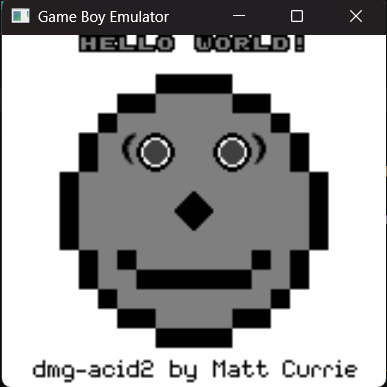

# GameBoy Emulator (WIP)

This is a work-in-progress GameBoy emulator written in C++. 

## Current Features
- Full implementation of all 501 GameBoy opcodes, with all instructions (excpet for EI) passing [SingleStepTest's SM83 Test Suite](https://github.com/SingleStepTests/sm83). For more info, check out sm83-tests branch.
- Interrupt handling implemented and tested.
- Cycle counting for all instructions complete
- (Almost) all I/O registers memory-mapped.
- Timer implemented and tested.
- Support for ROM-Only Cartridges
- All PPU features supported and tested with the [dmg-acid2](https://github.com/mattcurrie/dmg-acid2/tree/master) test rom:
  - Per-scanline rendering
  - Background, window, and sprite layers
  - X and Y scrolling behaviors for all 3
  - All sprite attributes (X & Y flipping, sprite vs. bg priority)
  - Tile map and tile addressing mode switching
  - BP, OBP0, and OBP1 palettes
 
## Planned Updates
- Add input handling.
- Run more test roms.

This project is in active development, so stay tuned for updates.
